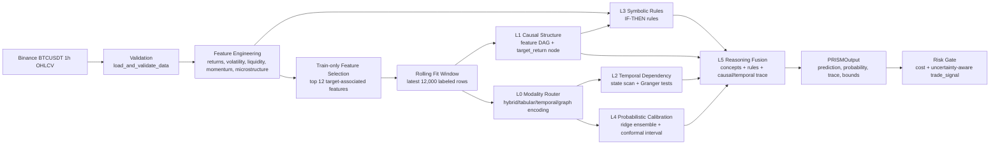
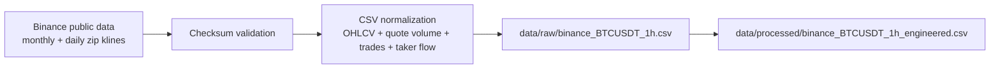
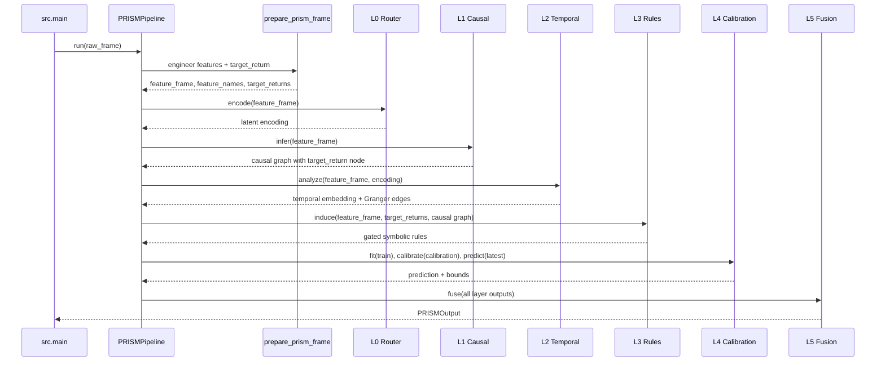
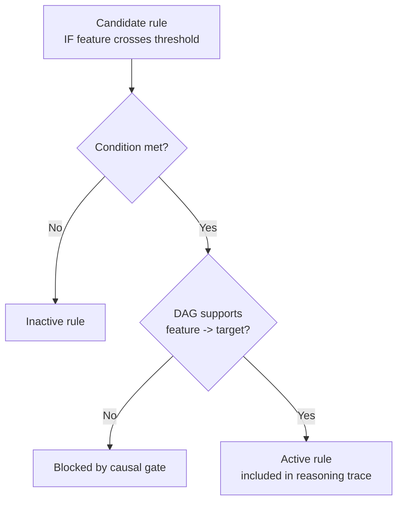
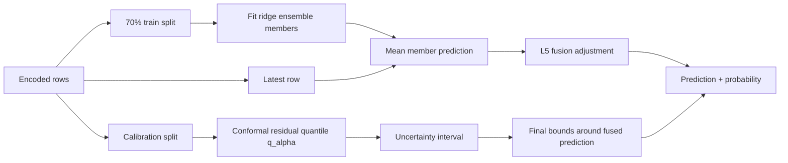
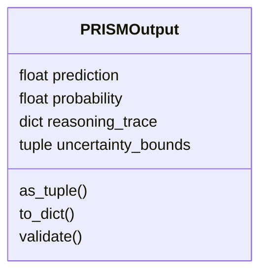
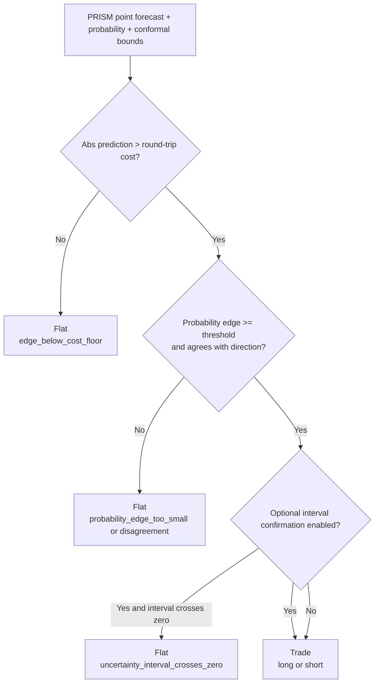

# Minimal PRISM Visual Guide

This project implements a deterministic test version of PRISM v0.3.0. It is not the full neural DAGMA/Mamba/deep-ensemble system. Its purpose is to make the architecture executable, inspectable, and testable.

## 1. End-to-End Pipeline

## 2. Layer Responsibilities

| Layer | File | What it does |
| --- | --- | --- |
| L0 | `src/prism/mod_router.py` | Converts market features into a fixed-width `d_model` representation. |
| L1 | `src/prism/cau_dagma.py` | Builds a lower-triangular acyclic feature graph and appends a terminal `target_return` node for predictive rule gating. |
| L2 | `src/prism/tem_dependencies.py` | Produces a smoothed temporal embedding and runs Granger causality tests. |
| L3 | `src/prism/sym_rule_induction.py` | Creates human-readable rules and blocks rules not supported by the DAG. |
| L4 | `src/prism/pro_calibration.py` | Fits a deterministic ridge ensemble and forms conformal prediction bounds. |
| L5 | `src/prism/fus_reasoning.py` | Combines prediction, concepts, rules, causal edges, temporal edges, and uncertainty. |
| Risk | `src/prism/trading.py` | Converts the PRISM forecast into long/short/flat only when cost and uncertainty gates pass. |
| Selector | `src/prism/pipeline.py` | Selects the strongest features using training rows only, then records selected features in the trace. |
| Rolling Fit | `src/prism/pipeline.py` | Uses the latest 12,000 labeled rows for fitting so stale BTC regimes do not dominate current models. |

## 3. Binance BTC Data Path

The project now treats Binance BTCUSDT 1h as the main dataset. Binance spot does not provide a literal BTC/USD pair in this path, so BTCUSDT is used as the practical USD proxy.

Useful commands:

- `make data-btc`: download BTCUSDT 1h Binance public archives.
- `make validate-btc`: validate downloaded OHLCV candles.
- `make engineer-btc`: export the expanded BTC feature matrix.
- `make run-btc`: run latest BTC inference.
- `make backtest-btc`: run the BTC walk-forward backtest and append history.
- `make regime-btc`: run broad BTC regime validation with prior-only threshold tuning.
- `make adaptive-btc`: compare fixed rolling/history candidates against prior-only model selection.
- `make calibration-sweep-btc`: compare calibration variants on broad and recent walk-forward windows.
- `make directional-btc`: run direction-first ridge/classifier variants and a prior-only selector toward the 0.60 directional-accuracy target.
- `make paper-trade-btc`: evaluate the direction sidecar as a strict paper strategy with fees, max exposure, and drawdown stop.

## 4. What `PRISMPipeline.run()` Does

## 5. Rule Gating Visual

The most important interpretability constraint is in L3: a rule can only become active when both the rule condition is true and L1 says the feature has a supported edge into `target_return`.

## 6. Prediction and Calibration Flow

## 7. Output Contract

Every successful run returns a `PRISMOutput`:

The `reasoning_trace` is the explainability payload. It includes:

- `active_concepts`: concept bottleneck signals above the configured threshold.
- `active_rules`: DAG-supported rules whose conditions are true.
- `all_rules`: every candidate rule, including blocked or inactive rules.
- `causal_edges`: L1 edges with scores, including feature -> `target_return` predictive edges.
- `temporal_edges`: top Granger-significant edges.
- `calibration`: conformal metadata, including `q_alpha` and calibration size.
- `trade_signal`: cost-aware long/short/flat decision with the exact reason.
- `fusion`: base prediction, rule signal, concept signal, and adjustment.

`src.main` also prints a top-level `directional_signal` research sidecar by
default. This sidecar is not part of the PRISM output contract and is not used
by trade execution. It exists to expose the direction-first selector that is
being validated toward the 0.60 directional-accuracy target.

## 8. Risk Gate

Current default uses cost, probability-edge, and interval-confirmation gates.
The tactical probability-only gate is available in regime validation, but it is
not the default because broader historical validation did not prove the recent
positive trading result robust across regimes.

## 9. Static Overview

For a non-Mermaid visual, open:

`docs/prism_pipeline.svg`

## 10. Improvement History

Backtest history is stored as CSV and rendered with Matplotlib/pyplot:

- `reports/backtest_history.csv`
- `reports/backtest_history.png`

Run `make backtest` to append the latest walk-forward metrics and regenerate the PNG plot.

Additional pyplot validation reports:

- `reports/regime_validation.png`: prediction and tuned-strategy behavior by market regime.
- `reports/adaptive_model_validation.png`: fixed candidate vs adaptive model-selection audit.
- `reports/calibration_sweep.png`: calibration-variant audit. This is intentionally separate from the default model so calibration changes are promoted only when broad and recent evidence agree.
- `reports/directional_accuracy.png`: direction-first accuracy audit with a dashed 0.60 target line. This is intentionally separate from default PRISM until recent dense validation is also robust.
- `reports/directional_paper_trading.png`: strict paper-trading audit for the direction sidecar. This remains research-only unless net returns, drawdown, and sample size continue to hold up out of sample.
